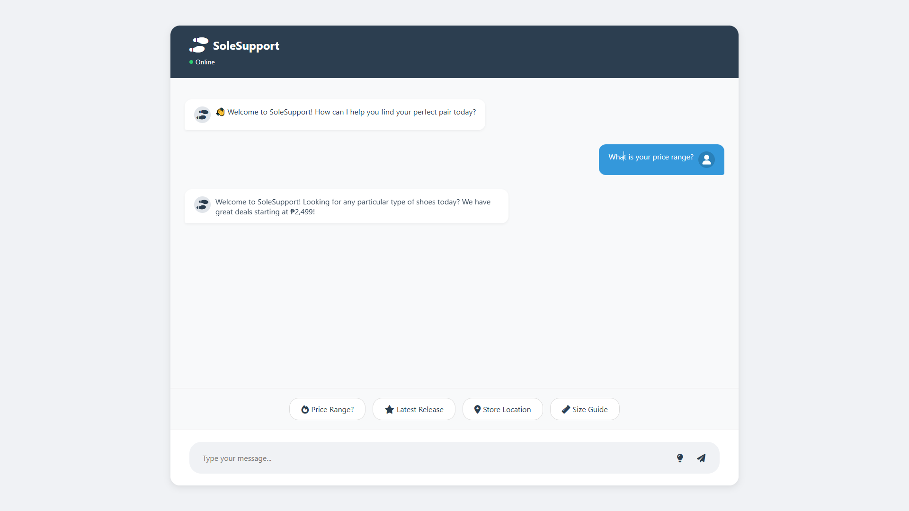
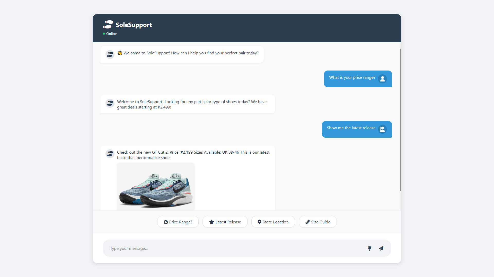
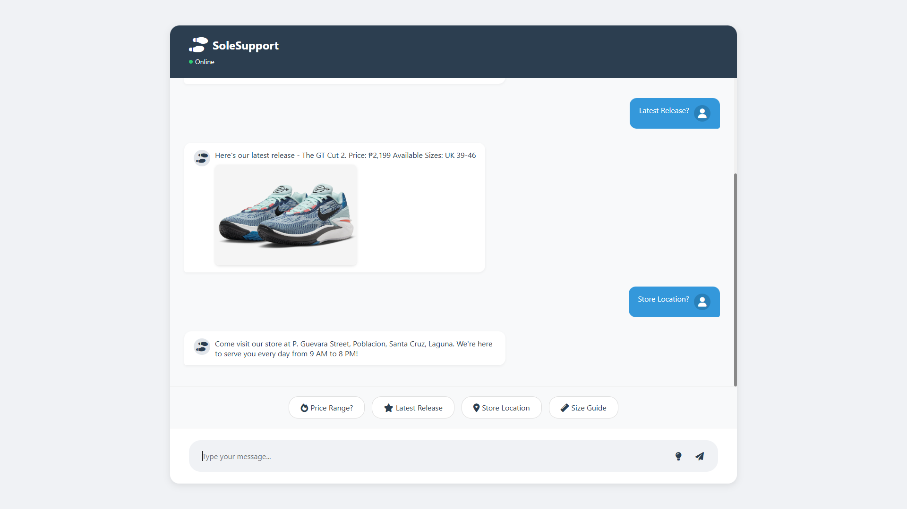
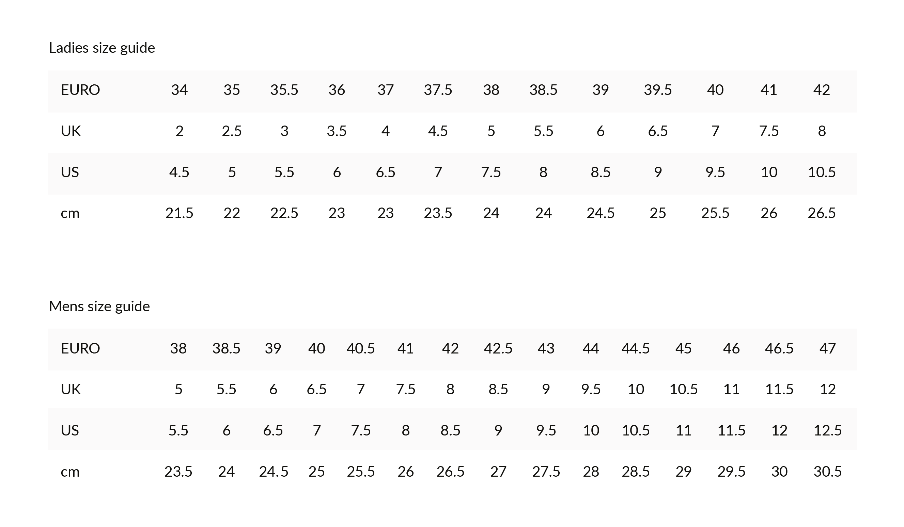

# SoleSupport Chat System

A context-aware customer support chat system for a shoe store, built with Flask and JavaScript.

## Features

- 🤖 Context-aware responses
- 💬 Natural language processing
- 🏪 Store location information
- 👟 Product inquiries and pricing
- 📏 Size guide with visual reference
- 🆕 Latest product releases with images
- 🛍️ Order tracking and support
- 💳 Payment assistance
- 🎫 Promotional deals

## Key Features Showcase

### 1. Price Range Information

Our chat system provides detailed pricing information for different shoe categories:
- Casual shoes starting at ₱2,499
- Athletic shoes from ₱3,499
- Premium models up to ₱15,999
- Special editions and limited releases

### 2. Latest Release Display

Showcasing our newest arrival - The GT Cut 2:
- Interactive product image
- Price: ₱2,199
- Available sizes: UK 39-46
- Clickable for full-size view
- Detailed specifications

### 3. Store Location Guide

Find us easily with our location information:
- Address: P. Guevara Street, Santa Cruz, Laguna
- Operating hours: 9:00 AM - 8:00 PM daily
- Landmarks and directions
- Public transportation routes
- Parking availability

### 4. Size Guide Reference

Comprehensive size guide featuring:
- Visual measurement instructions
- Size conversion chart
- Width measurements
- Brand-specific sizing
- Fit recommendations

## Response Categories

The chat system includes the following main categories:

### Customer Service
- **Greeting**: Welcome messages and initial interactions
- **Appreciation**: Handling thank you messages
- **Goodbye**: Farewell responses
- **Feedback**: Customer feedback and reviews
- **Complaints**: Handling customer issues

### Product Information
- **Product Inquiry**: General product and pricing information
- **Latest Release**: Information about new products (GT Cut 2)
- **Size Guide**: Shoe sizing information with visual guide
- **Running Shoes**: Specialized running shoe information
- **Technical Specs**: Detailed product specifications
- **Product Comparison**: Help with comparing different products

### Store Information
- **Store Location**: Physical store address in Santa Cruz, Laguna
- **Promotions**: Current deals and discounts
- **Bulk Orders**: Wholesale and large order inquiries

### Purchase Support
- **Payment Issues**: Help with transaction problems
- **Order Status**: Order tracking and delivery updates
- **Shipping Info**: Shipping options and costs
- **Refund**: Return and refund process
- **Warranty**: Product warranty information

### Account Management
- **Account Support**: Login and registration help
- **Technical Support**: Technical issue resolution

## Quick Suggestions

The chat interface includes quick suggestion buttons for common queries:
- Price Range
- Latest Release
- Store Location
- Size Guide

## Special Features

### Latest Release Display
- Shows GT Cut 2 product image
- Displays price (₱2,199)
- Lists available sizes (UK 39-46)
- Clickable image for full-size view

### Size Guide
- Visual size chart
- Measurement instructions
- Size conversion information

### Store Location
- Address: P. Guevara Street, Poblacion, Santa Cruz, Laguna
- Operating hours: Monday to Sunday, 9:00 AM to 8:00 PM

## Technical Implementation

### Context Awareness
The system maintains conversation context through:
- Session management
- Pattern matching
- Category tracking
- Follow-up response handling

### Response Types
- Text responses
- Image responses
- Interactive elements
- Context-based suggestions

